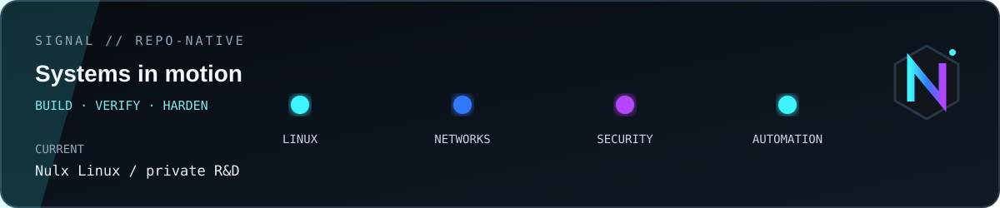

<div align="center">



<br />

<a href="https://www.linkedin.com/in/alhasan-alhmondi"></a>
<a href="mailto:a.a@nulxlinux.com"></a>
<a href="https://github.com/Alhasan100?tab=repositories"></a>

</div>

## Identity

<table>
<tr>
<td width="170" align="center">
  <br />
  <sub><b>Alhasan Al-Hmondi</b></sub>
</td>
<td>

I study **Digital Infrastructure & Cybersecurity** at the University of Borås. I like the layer where security stops being theory and becomes a system you can build, inspect, break safely, and improve.

My work lives around **Linux, networks, defensive tooling, infrastructure automation, and disciplined troubleshooting**. I am currently building **Nulx Linux** — an independent Debian-based cybersecurity distribution — as private pre-alpha R&D.

`Göteborg, Sweden` · Open to IT support, operations, network and junior cybersecurity opportunities.

</td>
</tr>
</table>



## Selected systems

| Project | Mission | Stack |
| :--- | :--- | :--- |
| [**dns_sink0**](https://github.com/Alhasan100/dns_sink0) | Lightweight, network-wide DNS sinkhole built for speed and clean deployment. | Python · Docker |
| [**eventguard-ps**](https://github.com/Alhasan100/eventguard-ps) | Windows Security event triage with ATT&CK-aware findings and offline reports. | PowerShell · Windows |
| [**netbaseline-py**](https://github.com/Alhasan100/netbaseline-py) | Host exposure baselining and drift detection for Windows environments. | Python · Networking |
| [**serverSystem-Lab2-Del2**](https://github.com/Alhasan100/serverSystem-Lab2-Del2) | Proxmox lab with inventory reporting and desired-state automation. | Python · Ansible · Proxmox |

## Operating range

<div align="center">


</div>

## Engineering principles

```text
01  Understand the system before touching the fix.
02  Automate the repeatable; document the dangerous.
03  Test claims with evidence — especially in security.
04  Build for recovery, observability and the person on call.
```

## Signal

<div align="center">
  
</div>

---

<div align="center">
<sub><code>ALHASAN100 // BUILD · VERIFY · HARDEN · REPEAT</code></sub>
<br /><br />
<a href="mailto:a.a@nulxlinux.com">a.a@nulxlinux.com</a> · <a href="https://www.linkedin.com/in/alhasan-alhmondi">LinkedIn →</a>
</div>
